# Rede_de_Academia
 Criando uma rede de Academia {Linguagem ultilizada: REST APIs com Python, Flask e banco de dados SQLite3}.

# 💻Sobre o projeto
Uma API com banco de dados

# Projeto Rede de Academia
Esse Projeto tem como objetivo mostrar uma API com iteração com banco de dados em Postman.

# Como funciona o Projeto
Projeto tem como objetivo o usuário fazer um CRUD na API (Criar, Ler, Alterar, Deletar) acessando o bando de dados SQLite3

# Ambiente.
Para executar o projeto, basta você baixar os arquivos.
Pycharm, SQLite3, Postman

Após a instalação precisamos criar o ambiente virtual dentro do Pycharm com o seguinte comando.

Agora vamos ativar nosso ambiente virtual com o seguinte comando

Perceba que o código esta em amarelo. Após o enter ele ativa nosso ambiente virtual perceba que agora na linha de baixo começa com (Rede_de_Academia).

Para que o programa rode é necessário fazer a instalação de todas a requisições do arquivo: requirements.txt. Para quem usa o Pycharm colocando o comando pip install -r requirements.txt é o suficiente para os downloads. Segue a imagem ilustrativa a baixo.

 

pip install flask_restful

pip install flask 

pip install Flask-SQLAlchemy

Caso qualquer erro entrar no arquivo .txt e instalar manualmente as requisições. pip install nomeDaRequisição
 
# 🔥Executando o Projeto Localmente:

Basta executar o arquivo app.py dentro mesmo do Pycharm como segue na imagem
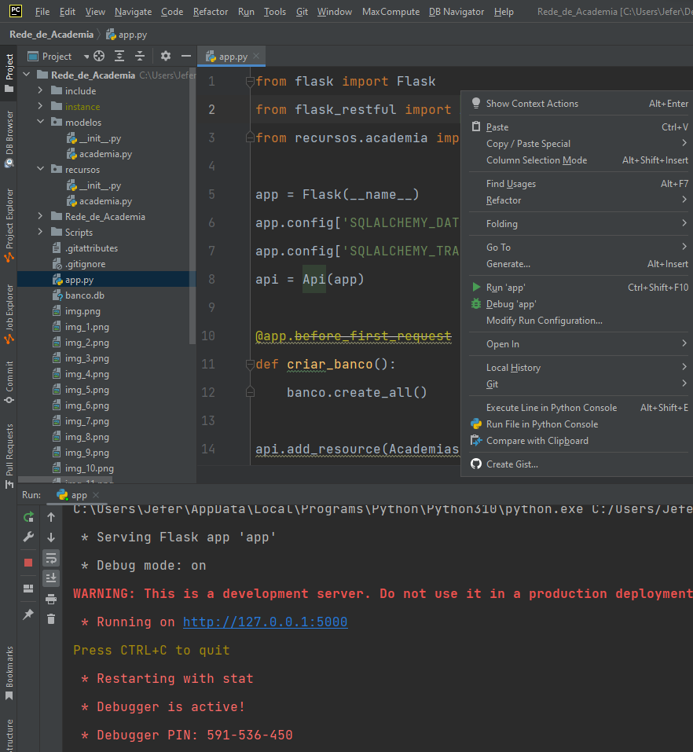

Usando as configurações do Postman com nosso IP: http://127.0.0.1:5000/academia
Podemos consultar quais academias temos em nosso banco de dados. Segue a imagem
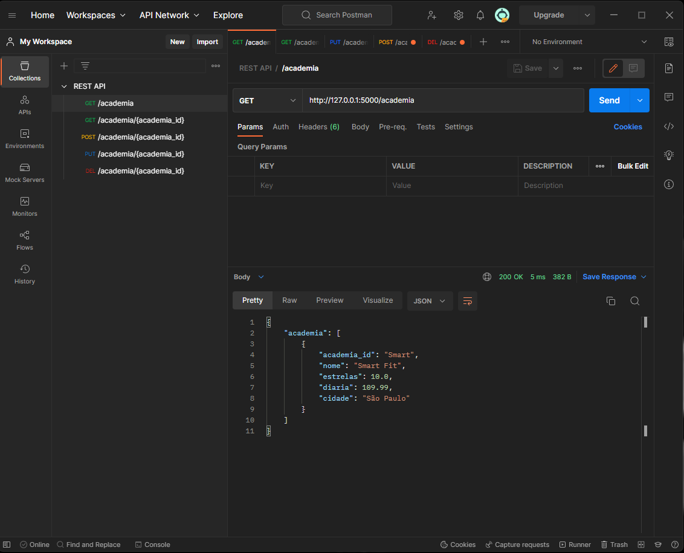

Vamos adicionar uma nova academia, perceba na imagem a baixo que ja foi adicionada uma nova academia ao banco de dados
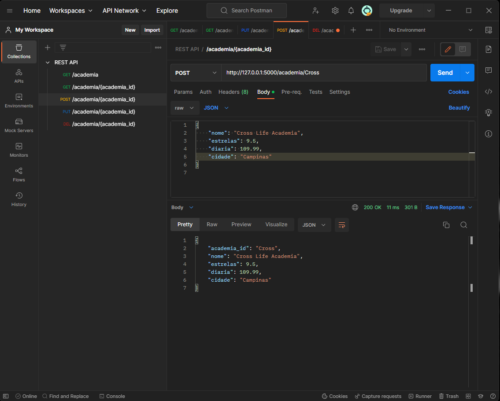

caso queira adicionar novamente a mesma informação, você será notificado que ela já existe no bando de dados.
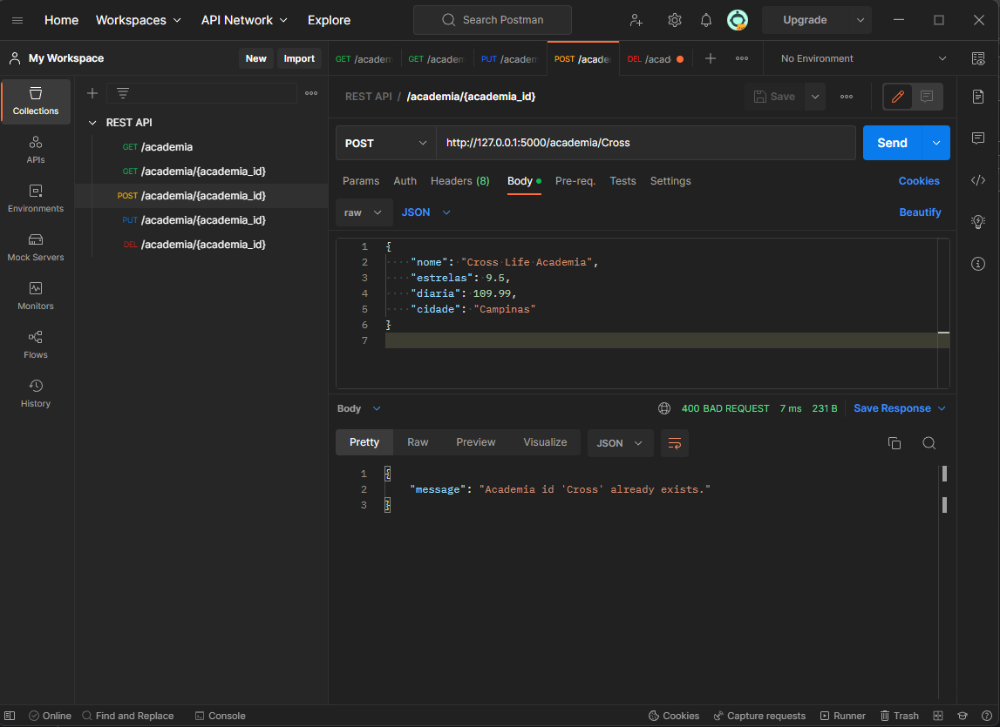

Caso você tenha errado e precise alterar algo, vamos a função PUT que ela não só altera como verifica se existe no banco de dados, se ja existir ela alterar, caso não, ele cria um novo.
Vamos alterar primeiro.
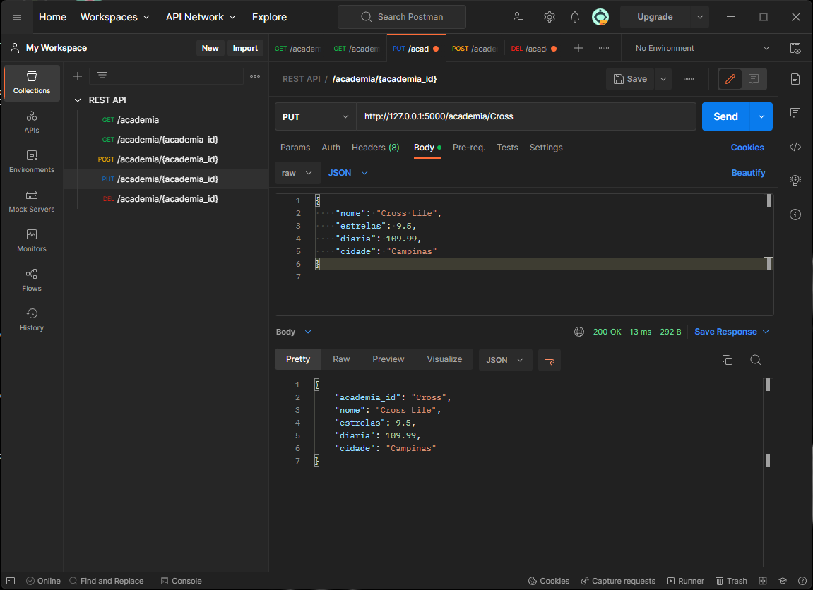

como vocês podem observar a palavra "Academia" foi retirado do nome. Continuando vamos criar uma nova academia também na função PUT
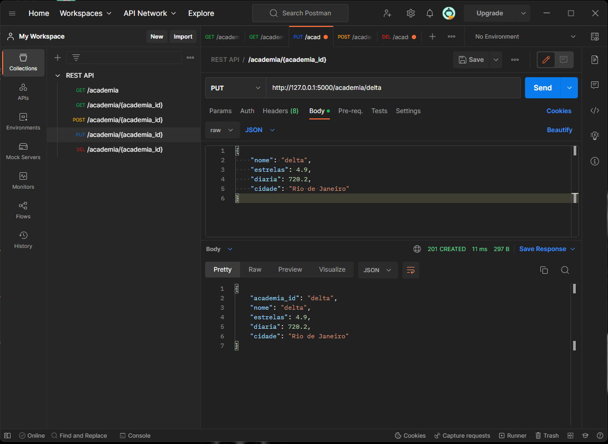

Agora vamos verificar em nosso banco de dados as informações que foram adicionadas.
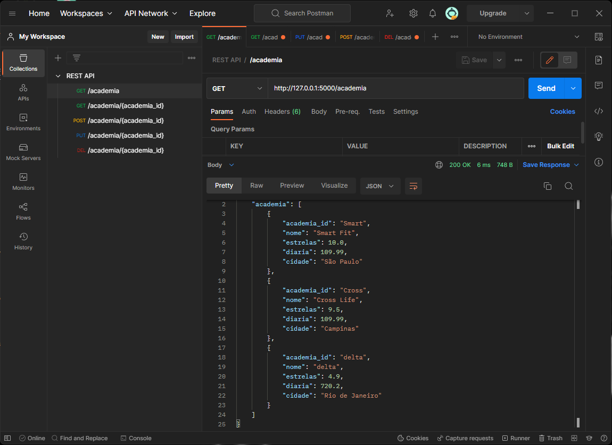
Perceba na imagem a cima que a academia "Cross" teve seu nome alterado com sucesso e tambem a nova academia Delta foi adicionada como fizemos.

E por fim vamos excluir uma academia
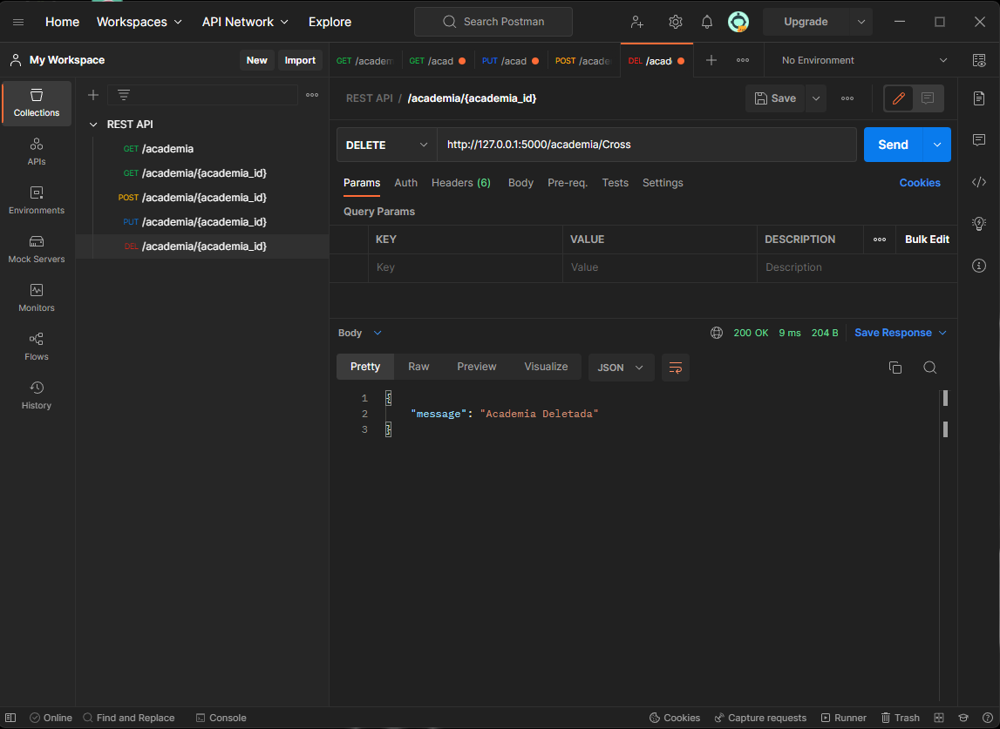
caso eu tente excluir novamente a mesma academia ele nos retornará um erro

Agora vamos para o GET consultar se foi de fato excluida a academia
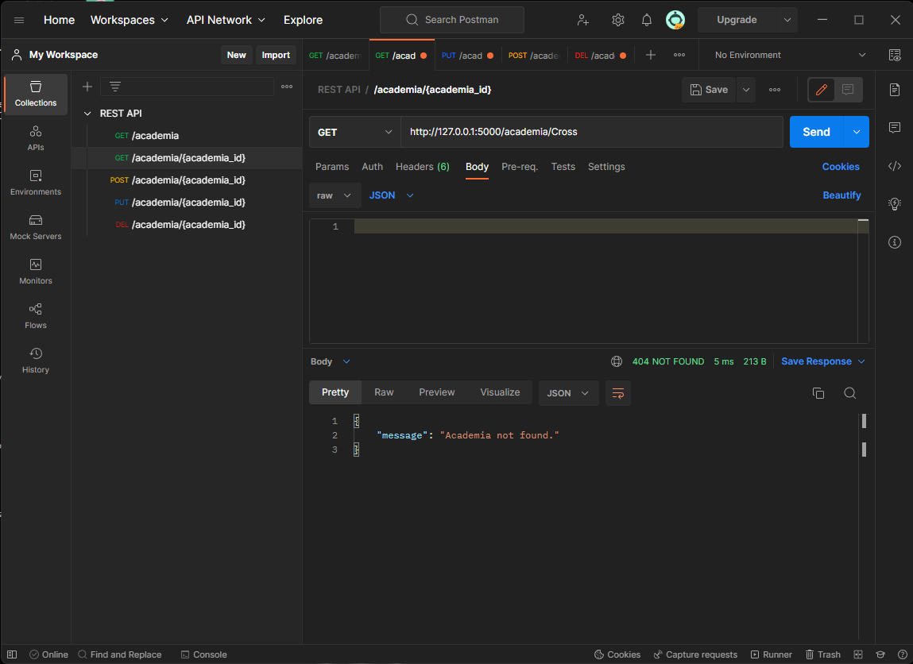

e se você buscar por qualquer outra academia em nosso banco de dados
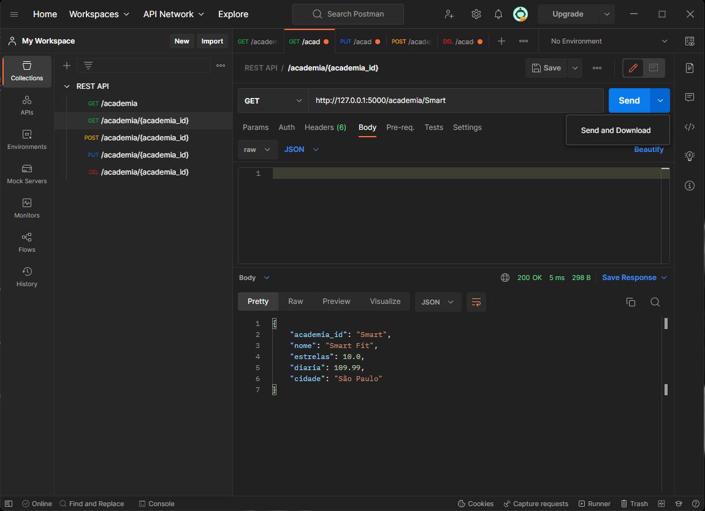

e por fim nosso banco de dados ficou assim.
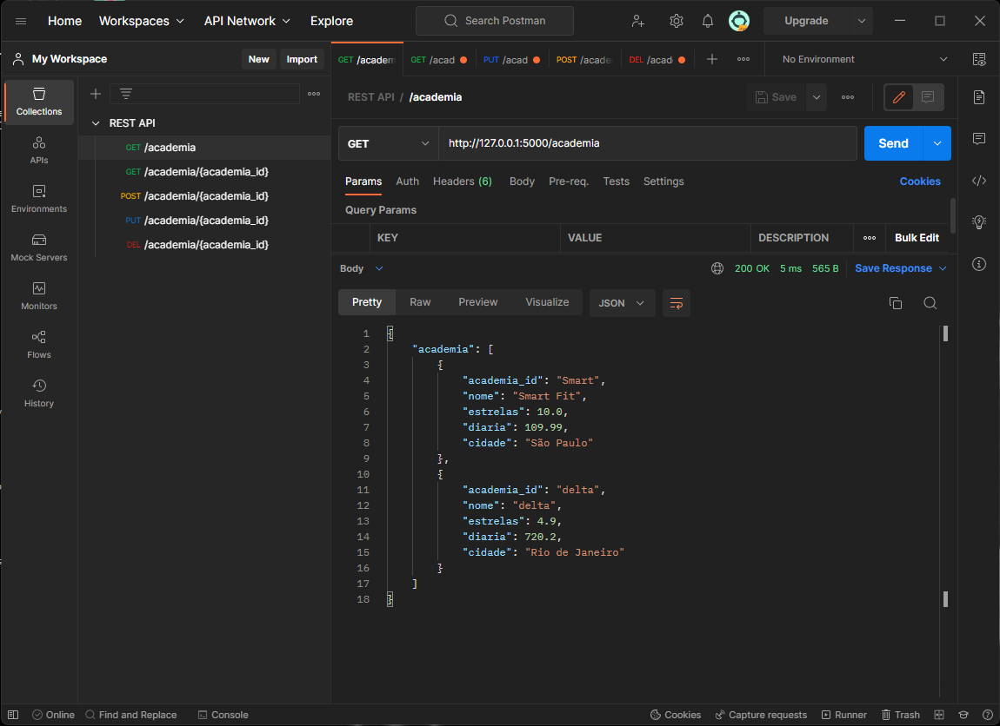
