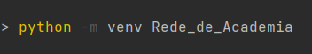
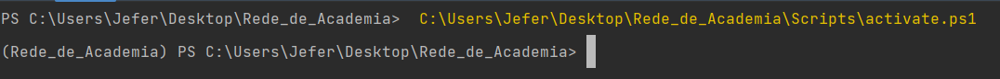
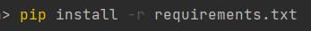

# Rede_de_Academia
 Criando uma rede de Academia {Linguagem ultilizada: REST APIs com Python, Flask e banco de dados SQLite3}.

# 💻Sobre o projeto
Uma API com banco de dados

# Projeto Rede de Academia
Esse Projeto tem como objetivo mostrar uma API com iteração com banco de dados em Postman.

# Como funciona o Projeto
Projeto tem como objetivo o usuário fazer um CRUD na API (Criar, Ler, Alterar, Deletar) acessando o bando de dados SQLite3

# Ambiente.
Pycharm, SQLite3, Postman
 
# 🔥Executando o Projeto Localmente:
Para executar o projeto, basta você baixa os arquivos.

Após a instalação precisamos criar o ambiente virtual com o seguinte comando.

Agora vamos ativar nosso ambiente virtual com o seguinte comando

Perceba que o código esta em amarelo. Após o enter ele ativa nosso ambiente virtual perceba que agora na linha de baixa começa com (Rede_de_Academia).

Para que o programa rode é necessário fazer a instalação de todas a requisições do arquivo: requirements.txt. Para quem usa o Pycharm colocando o comando pip install -r requirements.txt é o suficiente para os downloads. Segue a imagem ilustrativa a baixo.
